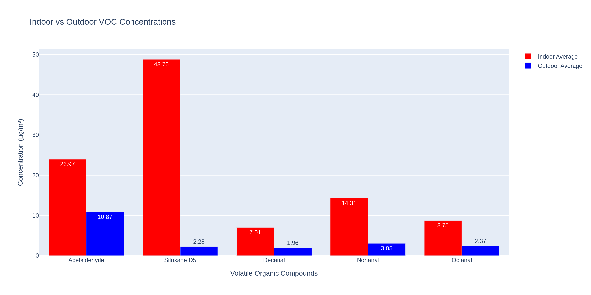
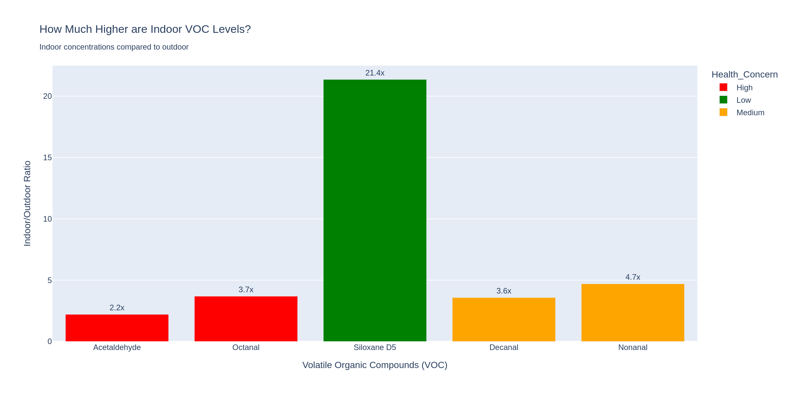

# VOCs - Indoor vs Outdoor Comparison for Neoplants 


## Key Finding
- Significant opportunity for bio-engineered plants to improve indoor air quality

## Visualizations




## Running the Analysis - If you would like to generate the html files for interactive viewing! 
```bash
pip install -r requirements.txt
python voc_code.py
